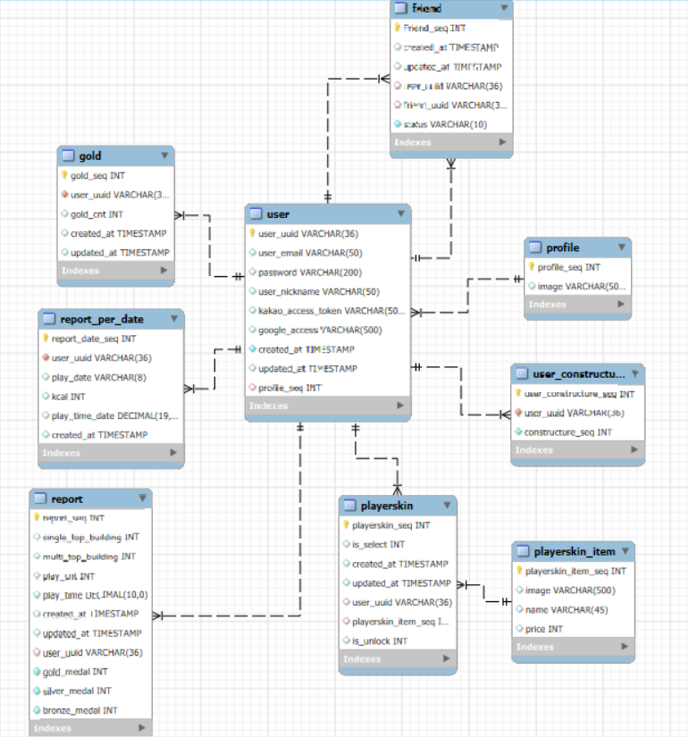

!!!!여기 이쁜 이미지 넣어줘

## 🥊 주먹이 운다 (E106)

> 권투 기반 철거 게임
한때 챔피언을 꿈꾸던 복서, 이제는 철거 현장에서 주먹으로 세상을 부순다!
싱글·멀티 모드, 모션 인식, 랭킹 시스템까지 갖춘 차세대 액션 게임 🎮

---

## 📆 프로젝트 기간

**2025. ~ 2025. ()**

---

## 📔 프로젝트 개요

- 권투 액션과 철거 시뮬레이션을 결합한 신개념 체감형 게임
- OpenVidu + LiveKit 기반 멀티플레이 실시간 대전
- MediaPipe 기반 모션 인식으로 실제 복싱 동작을 게임 속 액션으로 반영
- 건물 파괴, 스테이지 클리어, 골드 획득, 랭킹 시스템 탑재
- 칼로리 소모량까지 측정하는 피트니스 요소 결합

---

## 👥 팀원 소개

### 👤 박민준 (팀장)

<이미지>

- **이메일**
    - qkralswns924@naver.com
- **담당**
    - FRONTEND
      - 회원가입/로그인 페이지 구현 및 백엔드 연동
      - 메인 화면 / 게임 화면 UI 개발
      - 캐릭터, 건물, 이펙트 등 스프라이트 제작 및 적용
      - 게임 홍보 동영상 제작
    - BACKEND

---

### 👤 윤혜진

<이미지>

- **이메일**
    - 이메일
- **담당**
    - FRONTEND
        
    - BACKEND

---

### 👤 조창현

<이미지>

- **이메일**
    - 이메일
- **담당**
    - FRONTEND
        
    - BACKEND

---

### 👤 장준혁

<이미지>

- **이메일**
    - 이메일
- **담당**
    - FRONTEND
        
    - BACKEND

---

### 👤 신유빈

<이미지>

- **이메일**
    - 이메일
- **담당**
    - FRONTEND
        
    - BACKEND

---

### 👤 홍지훈

- **이메일**
    - wlgns9807@naver.com
- **담당**
    - FRONTEND
      - 게임 코어 로직 구현
      - WebRtc 기반 프론트엔드 배포 환경 구성 (MediaPipe · OpenVidu)  
    - BACKEND
      - 게임과 관련된 통계, 골드, 건물 생성, 스킨 API 작업
      - SMTP 기반 이메일 인증 API 작업
      - Spring Security JWT 인증 뼈대구성
      - AWS EC2, Nginx, Openvidu, Livekit 영속성 인프라 작업
      - Docker, Jenkins CI/CD PipeLine 구성

---

## 🧰 기술 스택

| 분류 | 사용 기술 |
|------|-----------|
| **Language** | `Java`, `JavaScript` |
| **Backend** | `Spring Boot 3.4.5`, `Spring Security`, `JPA`, `JWT`, `Livekit` , `SMTP` |
| **Frontend** | `React`, `Pixi.js`, `Openvidu3.3.0`, `MediaPipe` |
| **DB** | `MySQL`, `Redis` |
| **DevOps** | `Git`, `Docker`, `Docker-Compose` , `AWS EC2`, `Jenkins`, `Nginx` |

---

## 📁 문서

### 🛠 시스템 아키텍처

### 🧩 ERD

---

## **🖥️ 주요 기능**

## 🏠**메인 페이지(Web)**

| |
| --- |
| **메인 화면**   서비스의 첫 진입 페이지로, 로그인, 검색, 최근 검색 기록, 뉴스 기능 등의 카테고리를 사용할 수 있습니다. |

### 🔐 **로그인 기능**

|  ||
| --- | --- |
| **로그인 화면**   로그인을 진행하며 회원가입 페이지로 이동 가능합니다. | **회원가입 화면**   회원가입을 진행할 수 있습니다. |

### 🔎 **메인 화면 : 검색 기능**

|  | |
| --- | --- |
| **장소와 아파트 검색**   장소와 아파트 토글 기능으로 사용자가 원하는 필터링 검색기능이 제공됩니다. | **최근 검색어 기능**   최근에 검색한 내역을 저장합니다. 저장된 검색어는 UI 상단에 표시되며, 클릭 시 바로 재검색이 가능해 검색의 편의성을 높입니다. |

### 📊 **메인 화면 :** **사용자 편의 기능**

| |
| --- |
| **광역시별 매물 통계**   당해 광역시별 매물 통계 데이터를 가져오며, 사용자는 매물 건수와 평균 매매가 를 확인할 수 있습니다. |
|  |
| **오늘의 NEWS**   해당 일자의 최신 뉴스를 사용자가 확인할 수 있는 기능입니다. 매일 업데이트 되는 뉴스 리스트를 통해 부동산 관련 정보에 빠르게 접근 할 수 있습니다. |
|  |
| **최근 본 아파트**    
최근 본 아파트는 유지되며,사용자 편의를 위해 슬라이드 카드형 UI로 구성되어 있습니다. |

## 🗺️ **지도(Map)**

### 👤 **지도 :** **기본 UI**

|  |
| --- |
| **행정 지역 단위 경계 적용**   지도의 가독성과 상호작 용성을 높이기 위한 기능으로, 사용자가 지도 위 행정 구역(시,군,구)에 커서를 올리거나 클릭할 때 해당 지역의 경계선이 시각적으로 표시됩니다. |
|  |
| **행정 단위 검색**   지도 상단의 행정단위 검색 UI를 통해 사용자가 관심 지역을 빠르게 탐색할 수 있습니다. |
|  |
| **검색된 아파트 마킹**   검색된 아파트의 마커를 클릭하면 해당 위치로 이동하며 상세 정보가 함께 표시됩니다. |
|  |
| **맵 확대/축소, 스플릿 UI**    
지도 확대/축소 기능과 리스트 연동형 스플릿 UI를 통해 직관적인 탐색 경험을 제공합니다. |

### 👤 **지도 :** **아파트 관련 핵심 기능**
|  |
| --- |
||
| **아파트 기준 검색기능**    아파트 기준으로 지도 검색하며 유사한 아파트 내역을 조회할 수 있습니다. |
||
| **장소 기준 검색기능**    장소 기준으로 지도를 검색합니다. |
||
| **실거래가 조회와 페이지네이션**    아파트에 등록된 실거래가 내역을 조회할 수 있으며 페이지네이션 기능이 적용되어 있습니다. |
|  |
| **리뷰 등록 기능**    선택된 아파트의 리뷰 조회와 등록을 할 수 있습니다. 3일전에 등록된 경우 New UI가 활성화 됩니다. |
|  |
| **AI 요약 리뷰 기능**    선택한 아파트 정보를 기반으로 AI가 요약 리뷰를 자동 생성해 제공합니다. |
|  |
|  **즐겨 찾기 기능**    회원이 아파트를 즐겨찾기에 추가할 수 있으며, 아파트에 등록된 즐겨찾기 수를 집계합니다. |
|  |
|  **회원별 즐겨찾기 목록**    회원이 추가한 즐겨찾기 목록을 조회합니다. |

|   | | |
| --- | --- |--- |
|  **아파트 이미지 호버 줌 기능**    아파트 이미지에 커서를 두면 이미지를 확대하여 볼수 있습니다. | **선택 아파트의 상권 정보**  선택된 아파트의 상권 정보를 원형 그래프로 제공합니다. | **유사 아파트 검색기능**   기본적인 장소 기능 외에도 아파트 토글 선택 시, 검색어와 유사한 아파트 목록을 제공합니다. |
